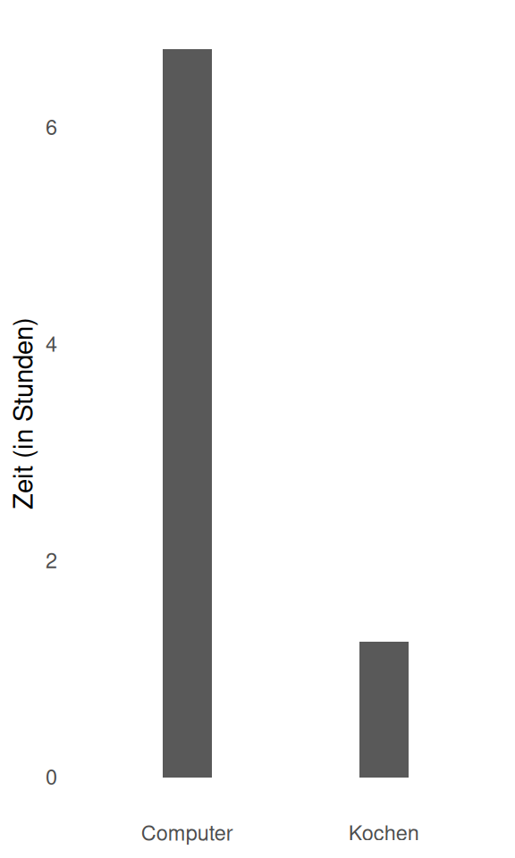

# {background-image="images/table-setting-6859276_1280.jpg"}

::: {.notes}

**Cooking metaphor**

- Imagine you were invited to a faboulus dinner at a distant relative's place
- You ask how the dinner was prepared, and the host proudly shows you the recepie
- (next slide)

:::


## {background-image="images/5FAoI86RaWY8Goqvt1b-77.jpg" background-size="contain" background-color="white"}

## 

```
PROPRIETARY RECIPE CARD

1. Add 2 units of Compound-XJ7
   ($15/bottle, our brand only)
2. Heat in Model-Pro-Pan-2024 at setting "MEDIUM"
3. Stir with Certified-Stirring-Tool
   (sold separately)
4. Add Flavor-Packet-B when indicator light turns green

⚠️ WARNING:
- Substitutions void warranty
- Recipe breaks if ingredients discontinued
- Do not attempt to understand the chemistry
- Model-Pro-Pan-2024 discontinued next year; upgrade required
```

::: {.notes}
- Point out: proprietary ingredients, mandatory equipment, warnings about substitutions, planned obsolescence. This should feel ridiculous.
- When confronted, the host has following arguments:
  - With this method, I know the meal is going to turn out great. I dont mind sacrificing a little freedom for that
  - If I wanted to cook myself, I would have to learn so many details. I dont have time for this.
  - Everone I know cooks like this. *We've been taught so in school*
- We would *NEVER* tollerate such a system in the cooking domain
:::

## Open Recipe Card

```
OPEN RECIPE

1. Sauté onions in oil until translucent
   WHY: Releases sugars, builds flavor base

2. Add garlic, cook 30 seconds
   WHY: Aromatic, cooks fast, burns easily

3. Add tomatoes, simmer 20 min
   WHY: Breaks down, concentrates

NOTES:
- No onions? Use shallots or leeks
- Olive oil or butter both work
- Any pan that conducts heat evenly
```

::: {.notes}
Contrast is key here. Note the "WHY" explanations - understanding vs blind following. Note the flexibility - substitutions welcome. This is what open source looks like.
:::


## Cooking vs. Computer


::: {.cell}
::: {.cell-output-display}
{width=960}
:::
:::


::: {.notes}
- We spent *much* more time at the computer than we spend cooking. 
- Why do we allow this in the digital domain?

:::


## {background-image="images/tim-1-crop.jpg" background-size="contain" background-color="white"}

::: {.notes}
- The pattern repeats:
- We've been here before
:::


## The Pattern Repeats

- We don't use document publishing systems, we use *Microsoft Office*
- We don't use Instant Messangers, we use *WhatsApp*
- We dont use GIS, we use *ArcGIS*

::: {.fragment}
- Are we going to use AI, or are will we use *ChatGPT*?
:::

::: {.notes}
:::


## The Vulnerability

Once you've invested in ChatGPT Plus...

- Learned their interface
- Built your prompts in their system
- **Stored your data with them**

::: {.fragment}
- → **Switching costs become ENORMOUS**4
:::

::: {.notes}
- Why?
:::


## Vendor Lock-In {data-background="images/Push-and-pull.jpg"}

::: {.notes}
- Vendors don't want you to be plattform independant
- They purposfully make their products incompatible with those of other vendors
- Once a certain level is reached, it's hard or even impossible to swith vendors
:::

## {background-image="images/5FAoI86RaWY8Goqvt1b-77.jpg" background-size="contain" background-color="white"}

::: {.notes}
- Going back to the cooking analogy
:::

## 

```
PROPRIETARY RECIPE CARD

1. Add 2 units of Compound-XJ7
   ($15/bottle, our brand only)
2. Heat in Model-Pro-Pan-2024 at setting "MEDIUM"
3. Stir with Certified-Stirring-Tool
   (sold separately)
4. Add Flavor-Packet-B when indicator light turns green

⚠️ WARNING:
- Substitutions void warranty
- Recipe breaks if ingredients discontinued
- Do not attempt to understand the chemistry
- Model-Pro-Pan-2024 discontinued next year; upgrade required
```

::: {.notes}
- Once *Model-Pro-Pan-2024*, *Certified-Stirring-Tool* and other similar products have been bought, it will be hard to use recepies by other vendors
:::

## Why is this a problem?

<!-- Add infuriating examples here? -->


## {.center}

> But not everyone can be a computer expert


::: {.notes}

- "10,000-hour rule," popularized by Malcolm Gladwell in his book Outliers, suggests that achieving mastery in a skill requires approximately 10,000 hours of practice.
- At 6 hours a day, you are a computer expert after about 7 Years

:::

## Three Layers

```{mermaid}
%%| fig-width: 8
flowchart TB
    A["Interface Layer<br/>'I know how to use ChatGPT'"]
    B["Implementation<br/>Open vs. proprietary"]
    C["Technology<br/>The fundamental capability"]

    A --> B --> C

    style A fill:#e1f5ff,stroke:#01579b,stroke-width:2px
    style B fill:#fff3e0,stroke:#e65100,stroke-width:2px
    style C fill:#f3e5f5,stroke:#4a148c,stroke-width:2px
```


## Fork in the Road {data-background-image="images/forest-6607631_1280.jpg" .center}

- Will we invest time and money into *the easy way* or into *the right way*?
- Will we become *masters of a techonology* or *users of a product*?


# OpenSource & LLM

<!-- continue here -->

::: {.notes}
Transition to solution mode. The rest of the workshop is about showing them this alternative exists and is viable. Energy should shift from provocative to empowering.
:::


## What LLMs Are

- Sophisticated pattern matching from *massive* text
- Like very advanced autocomplete
- Not "intelligence" but pattern recognition at scale

::: {.fragment}
**Not magic - technology you can understand**
:::

::: {.notes}
Keep this simple and non-threatening. Avoid technical jargon. The key message: it's not magic, it's understandable technology. You can learn this.
:::


## The Last 5 Years

- **2019:** GPT-2 impressive but limited
- **2023:** ChatGPT changes everything
- **2024-2025:** Open models catch up


::: {.notes}
TODO: Create timeline visual

Key insight: the gap between proprietary and open models is closing fast. This is recent history - open models becoming competitive is NEW. This creates the opportunity we're discussing.
:::

## Proprietary vs Open Weights

::: {.columns}
::: {.column width="50%"}
**Proprietary**
(ChatGPT, Claude, Gemini)

- Runs on their servers
- They see your data
- You pay subscription
- They control access
- Can change/remove features
:::

::: {.column width="50%"}
**Open Weights**
(Llama, DeepSeek, Mistral)

- Runs on YOUR hardware
- Your data stays local
- One-time hardware cost
- You control everything
- Stable, predictable
:::
:::

::: {.notes}
This is the key comparison slide. Take time with each point. Emphasize: "their servers vs YOUR hardware", "they see your data vs your data stays local". This is about control and sovereignty.
:::

## "Good Enough" is Good Enough

You don't need the absolute **best** model

::: {.incremental}
- You need one that solves YOUR problem
- With YOUR data privacy intact
- At YOUR cost structure
- Under YOUR control
:::

::: {.notes}
Critical mindset shift: you don't need the absolute best model. You need good enough for YOUR use case. This liberates them from thinking they must use ChatGPT-4 for everything.
:::

## The Three Enhancements

::: {.columns}
::: {.column width="33%"}
**RAG**

Retrieval Augmented Generation

Give LLM access to YOUR documents

*Example: IUNR course materials, research papers*
:::

::: {.column width="33%"}
**MCPs**

Model Context Protocol

Connect LLM to your tools

*Example: Field data, GIS, email, calendar*
:::

::: {.column width="33%"}
**Personas**

System Prompts

Shape how LLM behaves

*Example: "Teaching assistant for environmental science"*
:::
:::

::: {.notes}
These three enhancements make local LLMs powerful. Don't go too deep technically - just explain what each does and give concrete examples relevant to teaching. RAG is especially important for their use case.
:::

## Why Local Makes Sense for Teaching

- Student data is **sensitive** (GDPR, privacy)
- **Repetitive tasks** (grading, feedback)
- Custom **course materials** (RAG)
- One-time setup, **ongoing value**
- **No per-query costs**

::: {.notes}
Connect the dots: student data + GDPR = must be local. Repetitive tasks + no per-query cost = economically viable. This is why local makes sense specifically for teaching.
:::

## Transition

::: {.r-fit-text}
Okay, so what can you **actually DO** with this?
:::

::: {.notes}
Transition to practical applications. Shift from "why" to "what". Time to show concrete value.
:::

# 3. TEACHING USE CASES + BENCHMARKS {.section}

::: {.notes}
This section shows concrete teaching applications with benchmarks proving local models are good enough. Time: 8 minutes. Show 3 detailed examples, then quick list of others.
:::

## What Can Local LLMs Do For Teaching?

::: {.notes}
Section divider - pause, let the question hang.
:::

## Use Case 1: Generate Practice Questions

**Input:** Lecture slides or textbook chapter

**Output:** 10 multiple choice questions with explanations

**Why local:** Course materials often proprietary/sensitive

---

**Benchmark:**

```
ChatGPT-4:        ⭐⭐⭐⭐⭐
Local DeepSeek-r1: ⭐⭐⭐⭐⭐

Privacy: Local WINS | Cost: Local WINS
```

::: {.notes}
First use case: generating practice questions. Emphasize the benchmark - DeepSeek-r1 matches ChatGPT-4 quality. Point out privacy and cost advantages. This is a common teaching task.
:::

## Use Case 2: Student Writing Feedback

**Input:** Student essay or report

**Output:** Constructive feedback on structure, argument, clarity

**Why local:** Student work is confidential

---

**Benchmark:**

```
ChatGPT-4:        ⭐⭐⭐⭐⭐
Local DeepSeek-r1: ⭐⭐⭐⭐

Privacy: Local WINS | Cost: Local WINS
```

::: {.notes}
Second use case: writing feedback. Note: DeepSeek slightly lower quality (4 stars vs 5) but still good enough. Emphasize: student work is CONFIDENTIAL - this absolutely must be local for GDPR compliance.
:::

## Use Case 3: Summarize Research

**Input:** 30-page research paper

**Output:** 1-page summary for students

**Why local:** Can process many papers, no API costs

---

**Benchmark:**

```
ChatGPT-4:        ⭐⭐⭐⭐⭐
Local DeepSeek-r1: ⭐⭐⭐⭐⭐

Privacy: Local WINS | Cost: Local WINS
```

::: {.notes}
Third use case: research summaries. Back to 5 stars - matches ChatGPT quality. Point out: "Can process many papers, no API costs" - this is where local really shines economically. Process 100 papers? No problem, no extra cost.
:::

## More Use Cases

Other tasks that work well locally:

- Translate technical content to different reading levels
- Create interactive study guides with RAG
- Generate grading rubrics
- Answer student questions about course materials

::: {.notes}
Quick list - don't dwell on each. The point is to expand their mental model of what's possible. They can explore these later.
:::

## The Key Insight

- Local models are **"good enough"** for teaching tasks
- Quality gap has **closed dramatically**
- Privacy advantage is **huge**
- Cost: Hardware once, then **unlimited use**

::: {.notes}
Summary slide. Hammer home: "good enough" is the key concept. You don't need perfection. Quality gap has closed. Privacy is huge. Cost model is different and favorable for teaching use cases.
:::

## Transition to Demo

::: {.r-fit-text}
Let's see this in action
:::

::: {.notes}
Transition to live demo. Energy shift - this is the "proof" moment. Show, don't just tell.
:::

# 4. LIVE DEMO {.section}

::: {.notes}
Live demo section - 10 minutes. Show both ChatGPT and local Ollama side-by-side doing the same task. Audience participation - they give you the task. Have backup plan if tech fails.
:::

## Demo Intro

**Let's See It In Action**

- I'll run BOTH ChatGPT and local Ollama
- YOU give me a teaching task
- We'll compare results

::: {.notes}
Invite audience participation - "YOU give me a teaching task". This makes it more engaging and ensures the demo is relevant to their actual needs.
:::

## Demo Setup

::: {.notes}
Split screen or side-by-side
Same prompt to both
Real-time comparison

Possible demo tasks:
- Generate 5 exam questions from a text snippet
- Give feedback on a short student paragraph
- Summarize a research abstract
:::

[LIVE DEMO SCREEN]

## Demo Debrief

::: {.r-fit-text}
Same capability, different backends

One you control, one you don't

Both work for teaching tasks
:::

::: {.notes}
Key debrief points: same capability (both can do the task), different backends (one proprietary, one local), both work for teaching (proof that local is viable). Acknowledge if there were quality differences but emphasize "good enough".
:::

# 5. WHY OPEN SOURCE MATTERS {.section}

::: {.notes}
This section provides the supporting arguments for why control and sovereignty matter. Time: 7 minutes. Two betrayal examples, lock-in pattern, father's photo, urgency, callback to cooking.
:::

## Why Control Matters

::: {.notes}
Section divider - minimal speaking, let the question land.
:::

## Two Times You Were Betrayed

**Example 1: WhatsApp Leak**

- Billions of phone numbers exposed
- "You trusted them with your data"
- Everyone uses it, personal stakes

---

**Example 2: Windows 10 Obsolescence**

- Hardware made "obsolete" by software decision
- Environmental waste, e-waste crisis
- Forced upgrades, no choice

::: {.notes}
Two concrete examples of betrayal. WhatsApp: privacy violation, everyone uses it, personal stakes. Windows 10: environmental waste, forced obsolescence. These are real, documented events. Let anger simmer - these companies failed their users.
:::

## The Lock-in Pattern

```
         Cognitive Lock-in
         (I only know THIS)
              ╱│╲
             ╱ │ ╲
   Technical│  │ Institutional
   (Format) │  │ (Everyone uses it)
```

::: {.notes}
Explain the three types of lock-in: cognitive (you only know this one tool), technical (file formats, APIs), institutional (everyone else uses it). All three reinforce each other, making escape nearly impossible.
:::

## Father's Photo + Global Justice

{fig-alt="Linux workshop in Sri Lanka, 1998"}

"This has always mattered - licensing costs exclude entire regions"

**Open source = global equity**

::: {.notes}
TODO: Add actual photo

Personal moment. Your father taught Linux in Sri Lanka in 1998. This has always been about global justice and equity. Proprietary software licensing excludes entire regions of the world. Open source = access for everyone, regardless of geography or wealth.
:::

## The AI Choice is NOW

- In 2-3 years, everyone locked into ChatGPT like WhatsApp?
- Or will we preserve alternatives?

::: {.fragment}
**This window won't stay open forever**
:::

::: {.fragment}
**Good news:** Open models exist NOW
:::

::: {.notes}
Create urgency. We're at a choice point NOW. In 2-3 years, will everyone be locked into ChatGPT the way they're locked into WhatsApp? Or will we preserve alternatives? This window won't stay open forever. But good news - open models exist right now, today.
:::

## Recipe Callback

::: {.r-fit-text}
Remember the proprietary recipe?

Would you accept that for cooking?

**Then why accept it for AI?**
:::

::: {.notes}
Callback to opening. Bring it full circle. You wouldn't accept proprietary cooking - so why accept proprietary AI? Let this land. Pause.
:::

# 6. INTERACTIVE MOMENT {.section}

::: {.notes}
Quick interactive section - 5 minutes total. Two discussion prompts to get them thinking about application and lock-in in their own context.
:::

## Your Use Cases

::: {.r-fit-text}
What would YOU use local LLMs for in your teaching?
:::

::: {.notes}
Quick brainstorm (show of hands or call-outs)
Capture 3-5 ideas verbally
Validate: "Yes, that would work!"
:::

## Where Are You Locked In?

**Which tools feel hardest to escape?**

::: {.notes}
Quick discussion (2-3 people share)
"That's the lock-in we're talking about"
"Local LLMs can help break some of those chains"
:::

# 7. CLOSING: The Invitation {.section}

::: {.notes}
Closing section - 5 minutes. Return to opening question, show them they have options, address objections, give concrete next steps, close with resources.
:::

## Return to Fork in the Road

::: {.r-fit-text}
We started with a choice

**Is AI going to own us, or do we own AI?**
:::

::: {.notes}
Return to the opening question. Full circle. We started here, and now you've seen there IS an alternative. Remind them of the choice.
:::

## You Have Options

- Open weight models exist
- Hardware is capable (even laptops)
- Tools are maturing (Ollama, LM Studio)
- Community is growing

::: {.fragment}
**YOU can do this**
:::

::: {.notes}
Empowerment. List the evidence: models exist, hardware is capable (even laptops!), tools are maturing, community is growing. Build confidence. End with: YOU can do this. Emphasize YOU.
:::

## Address the Objection

"I don't have time to learn this!"

::: {.incremental}
- Yes, initial investment needed
- But: Pays off over time
- And: You're no longer vulnerable
:::

::: {.fragment}
*Cooking callback: Worth learning to cook vs. proprietary recipes*
:::

::: {.notes}
Address the biggest objection head-on: "I don't have time!" Acknowledge it's real - yes, initial investment needed. But counter: pays off over time, removes vulnerability. Cooking callback reinforces: worth learning to cook instead of being dependent on proprietary system.
:::

## Start Small

Try **ONE** thing this month:

- Install Ollama and run a model
- Generate one set of exam questions locally
- Test a local LLM for summarizing
- Explore LM Studio or similar tools

::: {.fragment}
**You don't have to switch everything at once**
:::

::: {.notes}
Give concrete, actionable next steps. Pick ONE thing to try this month. Lower the barrier to entry. Emphasize: you don't have to switch everything at once. Start small, build confidence, expand gradually.
:::

## Resources & Thank You

**GrüentAI team contact info**

- We're working on this for teaching
- We're here as a resource
- Reach out with questions

::: {.r-fit-text}
**Thank you**
:::

::: {.notes}
Close with resources and invitation to connect. Make it clear: GrüentAI is working on this specifically for teaching. You're here as a resource for them. Reach out with questions. Open door for continued conversation and support.
:::

